# Mbed Studio workshop

## 1. Installation

#### Offline
Run installer for your platform from `installers` folder located on usb flash drive.
#### Online
Download Mbed Studio for your platform from [https://os.mbed.com/studio](https://os.mbed.com/studio)

### Windows

1. On Windows during installation select `Install ST-Link USB drivers` option. It is required for flashing and debugging ST boards (including DISCO-L475VG-IOT01A) in Mbed Studio on Windows.

## 2. Login

Use Mbed account to login to Mbed Studio. Skip next step if you have an Mbed account.

### Create Mbed account

1. Click `Don't have an account? Create one now` link to create an account.
2. Follow sign up flow and confirm your account.

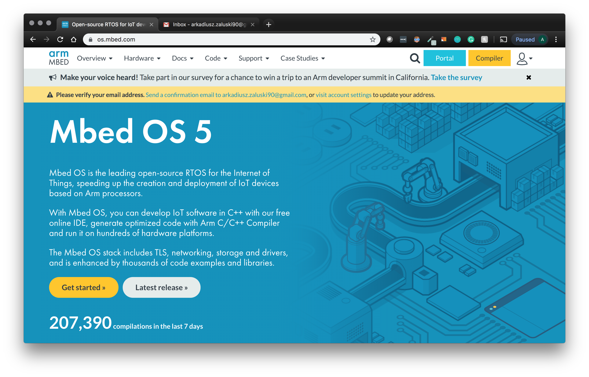

## 3. Import Mbed Cloud Client Example

#### Offline
Unzip `mbed-cloud-client-example.zip` file located in `examples` folder on usb flash drive into your workspace: `~/Mbed Programs`. Restart Mbed Studio if needed.
#### Online
Import `mbed-cloud-client-example` example using menu : `File->Import Program`.

Url: https://github.com/ARMmbed/mbed-cloud-client-example

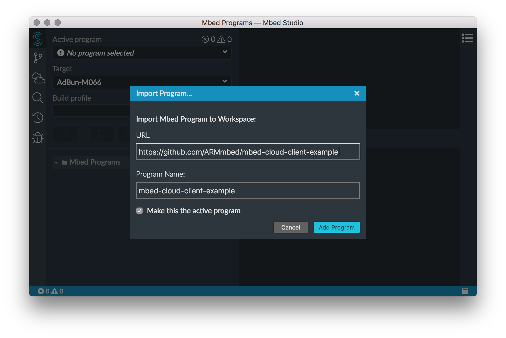

Depending on internet connection it may take a while. Progress is visible in bottom-right corner of Mbed Studio.

## 4. View libraries panel

Open Libraries panel from menu: `View->Libraries`

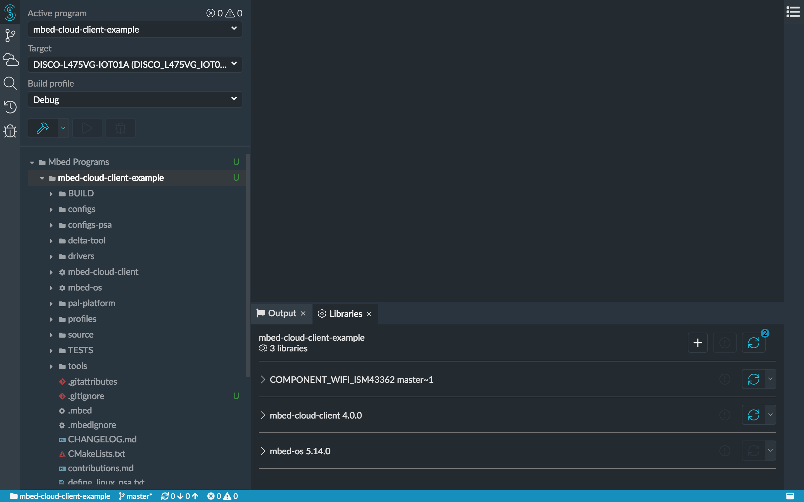

## 5. Connect a board

Connect [DISCO-L475VG-IOT01A](https://os.mbed.com/platforms/ST-Discovery-L475E-IOT01A/) board to laptop using micro USB cable.
Mbed Studio should recognise the board and allow user to select it for main program.

**Important**: Use micro usb port on the board marked as `USB STLINK` !

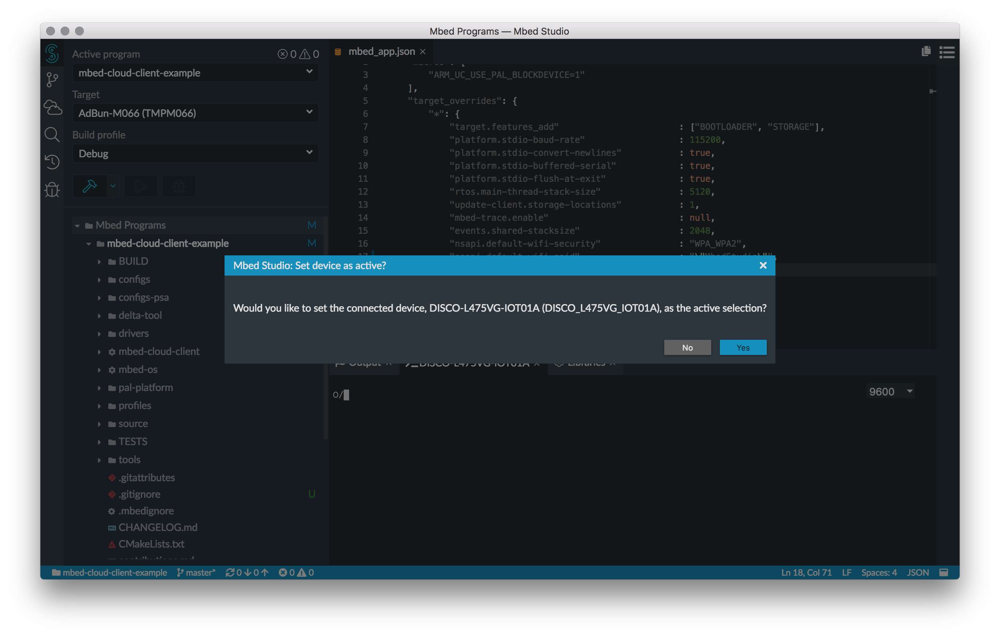

A green usb icon should appear next to the target indicating that board is connected. Deploy and Debug buttons should be now enabled.

Serial monitor should be automatically attached:

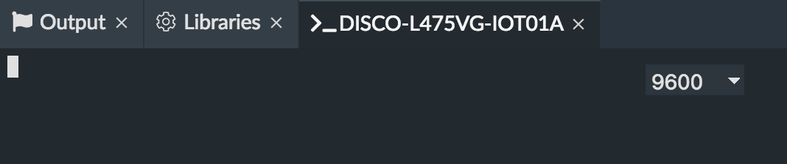

## 6. Create Pelion Device Management account

1. Open `PDM` support from menu: `View -> Pelion Device Management`.
2. Click `Pelion Device Management Portal` link. Skip to point 7 if you already have an api key.

3. Select `Log in with another provider` and then `Log in with account.mbed.com` option:

4. Register a `PDM` account:

5. Navigate into `portal.mbedcloud.com` and login to your account.
6. Create api key in portal. `Access management -> API keys`:

Select either Developers or Administrators group.
Copy api key after creation.

7. Paste api key in Mbed Studio:

## 7. Connect to Pelion Device Management

1. Copy `DISCO_L475VG_IOT01A` targets settings from `configs/wifi.json` into `mbed_app.json`:

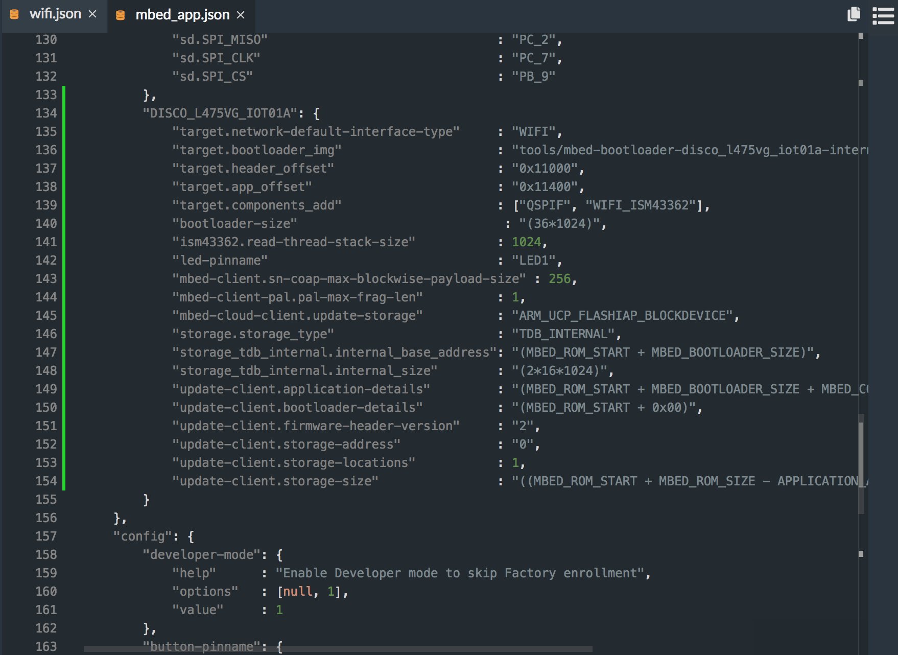

2. Set wifi credentials in `mbed_app.json`:

- default-wifi-ssid: `MbedStudio`
- default-wifi-password: `ilovembed`

3. Create new developer certificate:

4. Select a certificate using `plus` button:

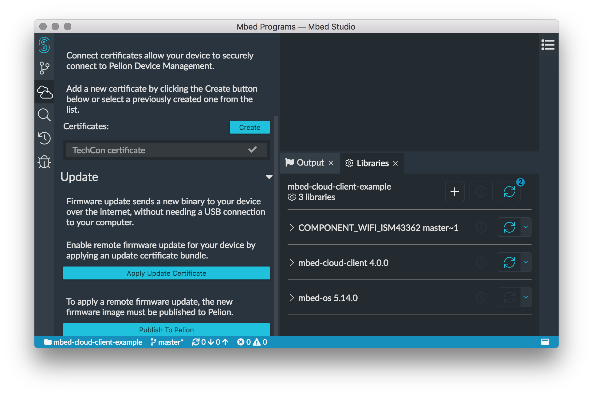

## 8. Flash a program on the device

1. Select `115200` baud rate from the dropdown on the `serial port` panel.
2. Click `Run` button on program panel. Mbed Studio will build a program and flash it on the device. Progress will be visible in `Output` panel and in bottom-right corner of Mbed Studio.
3. See logs in `serial port` panel:

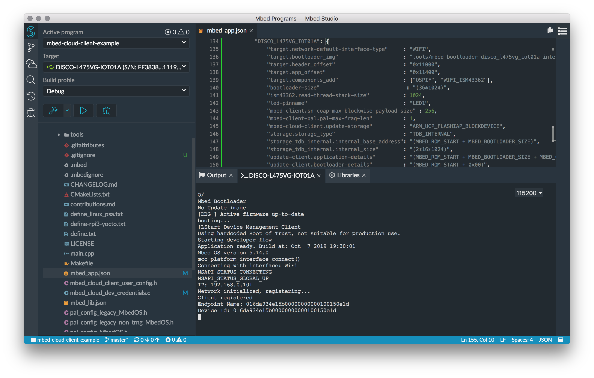

## 9. Manage a connected device in Pelion Device Management

1. In Pelion Device Management Portal go into `Device directory->Devices`:

2. Select a device and navigate into `RESOURCES` tab:

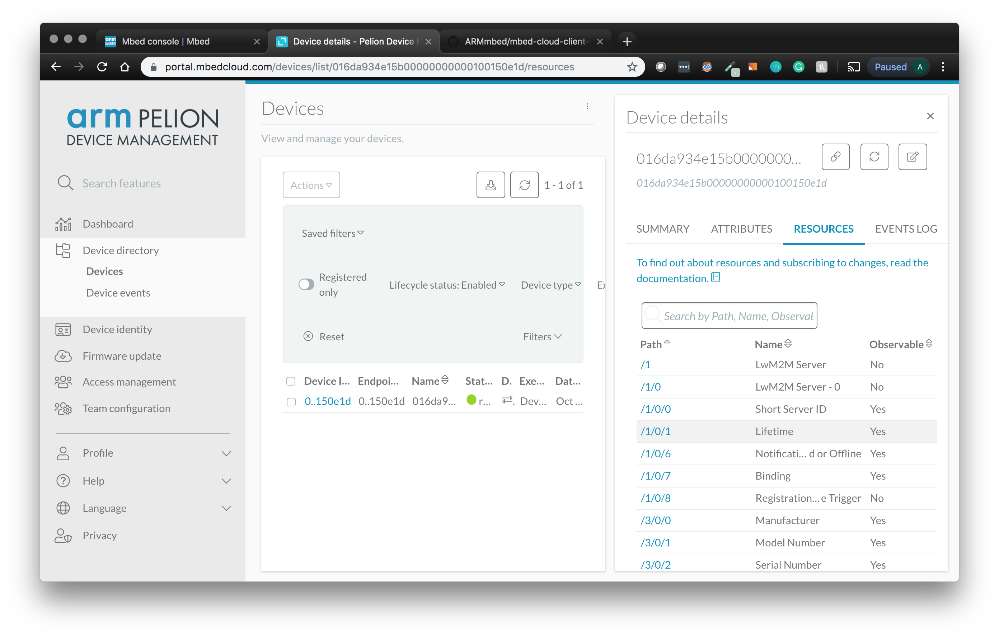

3. Search for `button_resource` with path: `/3200/0/5501` and select it.

4. Click an `USER` button on [DISCO-L475VG-IOT01A](https://os.mbed.com/platforms/ST-Discovery-L475E-IOT01A/) board (big blue button). Graph will automatically update after each press of the `USER` button:

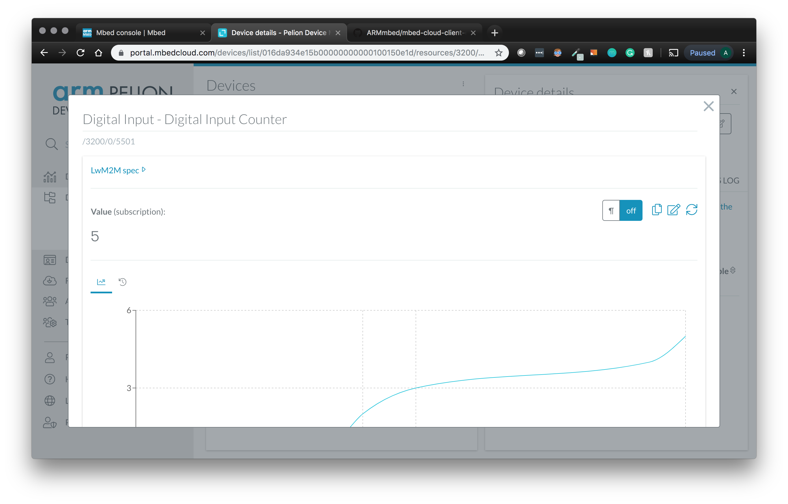

5. `Serial monitor` panel in Mbed Studio will log information about messages sent to Pelion Device Management:

## 8. Advanced Topics

#### Debugging

To start debugging click debug button in program panel. Program will be built and flashed into the device. Debug panel will appear and execution will stop on the first line in main.

- Add breakpoints
- Find in the code callback for `User` button click. Set breakpoint there and see that program stops after the button is pressed.

#### C/C++ intellisense

Open `main.cpp` file in editor. Write some code and check how C/C++ intellisense works in Mbed Studio.

Hint1: Hold ctrl to change variables or imports into links.
Hint2: There are many C/C++ intellisense actions available on right click in editor. For example: `Go to Type definition`.
Hint3: Remove semicolon from any line in editor and see what happens.

#### Extend mbed-cloud-client-example with additional functionality

[DISCO-L475VG-IOT01A](https://os.mbed.com/platforms/ST-Discovery-L475E-IOT01A/) board has many sensors built-in. Try to add new resource in `main.cpp` that exposes a value from a single resource. Read that value in Pelione Device Management Portal.

Avilable sensors:
- gyroscope/accelerometer/magnetometer
- proximity
- pressure
- humidity
- microphone

Hint1: Additional libraries may need to be added. To add a library click `plus` button in `Libraries` panel:

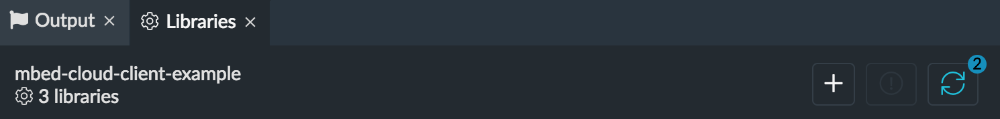

Hint2: https://os.mbed.com/teams/ST/code/HelloWorld_ST_Sensors/ may be useful.
